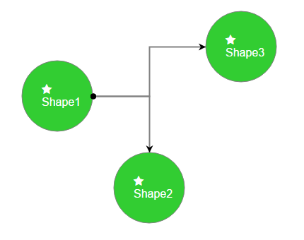

# Using FontAwesome in RadDiagram Visual Templates

In this how-to article you can see how to integrate the [FontAwesome](http://fontawesome.io/) icons in [Visual Templates in RadDiagram](). 

>caption Figure 1: Result after integrating FontAwesome icons from the code in Example 1.




The example below follows the scenario from the [Shapes Template](). Basically, to have the FontAwesome icons you should:

1. Include the FontAwesome style;
1. Use a TextBlock element in the desired shape's visual;
1. Modify it with the needed char code by setting it to the `text` property: `text: String.fromCharCode(0xf005)`;
1. And set the `fontFamily` property to "FontAwesome": `fontFamily: "FontAwesome"`.

>caption Example 1: Integrating FontAwesome icons in Visual Templates.

````ASP.NET
<link rel="stylesheet" href="https://cdnjs.cloudflare.com/ajax/libs/font-awesome/4.6.3/css/font-awesome.css">

<script type="text/javascript">
    var visualTemplate = function (options) {
        var diagram = kendo.dataviz.diagram;

        var group = new diagram.Group({
            autoSize: true
        });

        var circle = new diagram.Circle({
            width: 100,
            height: 100,
            fill: "#32CD32"
        });
        group.append(circle);

        var textBlock1 = new diagram.TextBlock({
            text: String.fromCharCode(0xf005),
            fontFamily: "FontAwesome",
            color: "#ffffff",
            x: 28,
            y: 32
        });

        group.append(textBlock1);

        var textBlock2 = new diagram.TextBlock({
            text: options.id,
            color: "#ffffff",
            fontSize: 16,
            x: 28,
            y: 50
        });

        group.append(textBlock2);
        return group;
    };
</script>

<telerik:RadDiagram ID="diagram1" runat="server">
    <ShapeDefaultsSettings Visual="visualTemplate"></ShapeDefaultsSettings>
    <ShapesCollection>
        <telerik:DiagramShape Id="Shape1" X="100" Y="110">
        </telerik:DiagramShape>
        <telerik:DiagramShape Id="Shape2" X="230" Y="240">
        </telerik:DiagramShape>
        <telerik:DiagramShape Id="Shape3" X="360" Y="40">
        </telerik:DiagramShape>
    </ShapesCollection>
    <ConnectionsCollection>
        <telerik:DiagramConnection StartCap="FilledCircle" EndCap="ArrowEnd">
            <FromSettings ShapeId="Shape1" Connector="Right" />
            <ToSettings ShapeId="Shape2" Connector="Top" />
        </telerik:DiagramConnection>
        <telerik:DiagramConnection StartCap="FilledCircle" EndCap="ArrowEnd">
            <FromSettings ShapeId="Shape1" Connector="Right" />
            <ToSettings ShapeId="Shape3" Connector="Left" />
        </telerik:DiagramConnection>
    </ConnectionsCollection>
</telerik:RadDiagram>
````

## See Also 

* [Shapes Template]()